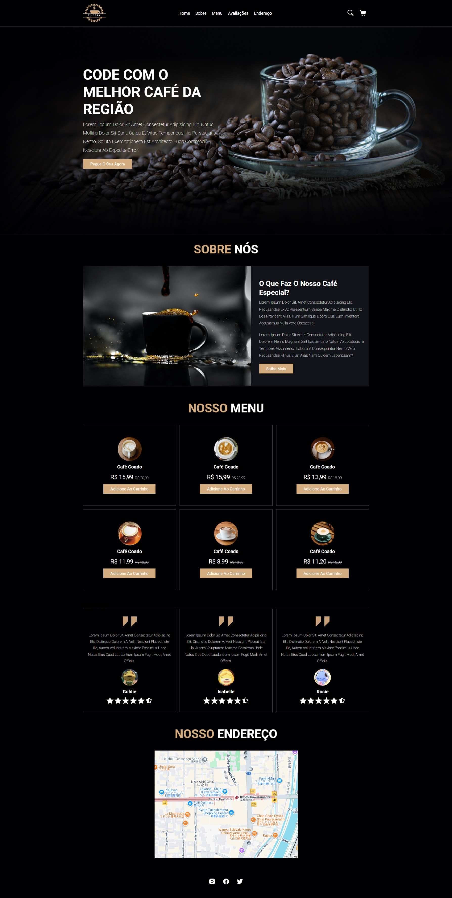

# ☕ Site de Cafeteria - DevClub

Este projeto é uma landing page de uma cafeteria fictícia, desenvolvida com HTML e CSS puro. Foi criado como parte do aprendizado com o vídeo [Novo Projeto | Criando um Site novo de Cafeteria](https://www.youtube.com/watch?v=v1jVqO6dx9A) do canal DevClub | Programação.

## 🔧 Tecnologias Utilizadas

- HTML5
- CSS3
- Responsividade com Flexbox

## 📸 Preview



## 🚀 Como visualizar

Você pode acessar o site diretamente pelo GitHub Pages:

🔗 [Clique aqui para ver o site através do GitHub Pages](https://maluwhoo.github.io/coffee-shop-html-css/)

Ou, se preferir, pode clonar o repositório e abrir o arquivo `index.html` no navegador:

```bash
git clone https://github.com/MaluWhoo/coffee-shop-html-css.git
